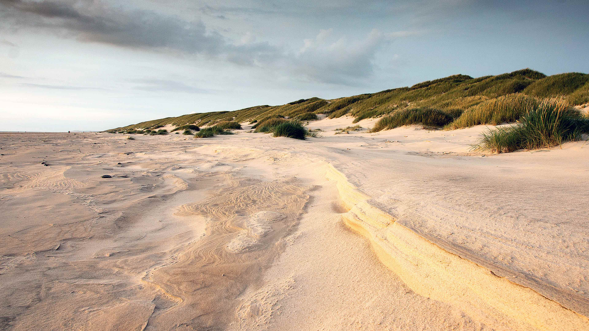
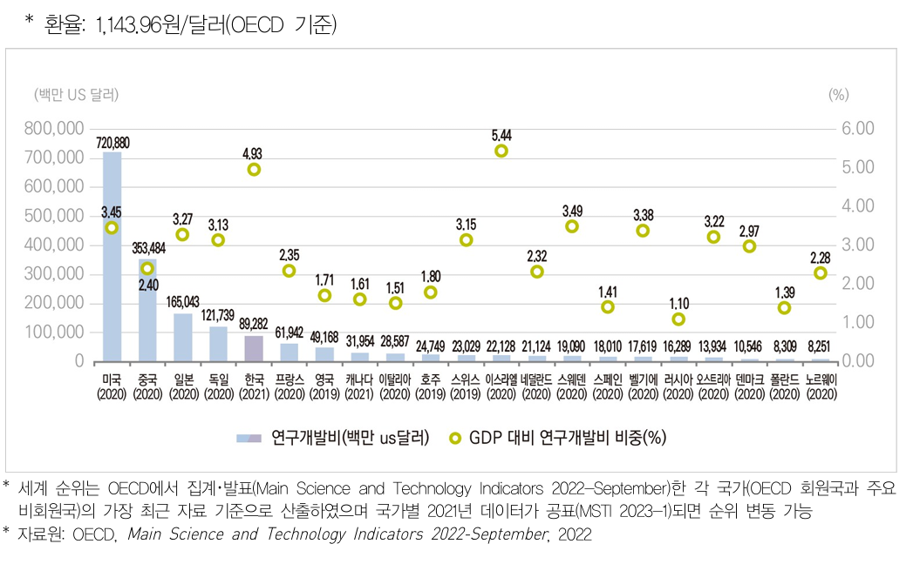
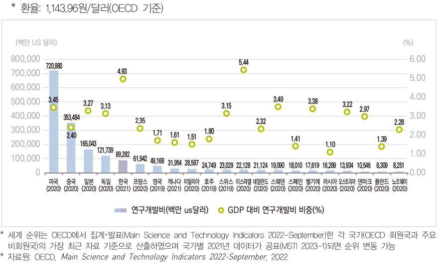
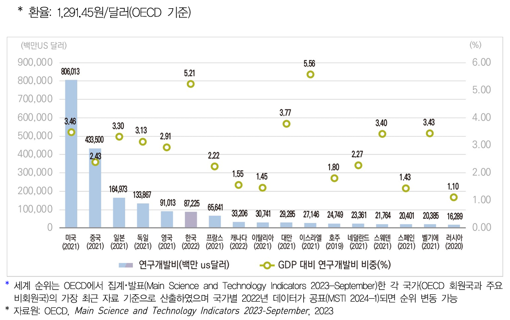
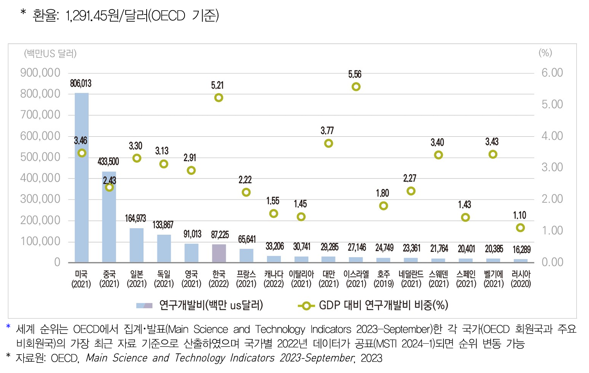

# 🖼️ 이미지 퀴즈 문제집 (Gemini)

## 문제 1

Q: 다음 이미지에 대한 설명 중 옳지 않은 것은 무엇인가요?
- (1) 넓은 들판에 기린 세 마리가 서 있습니다.
- (2) 지는 해로 인해 하늘이 주황색과 노란색으로 물들어 있습니다.
- (3) 기린들은 모두 카메라를 정면으로 바라보고 있습니다.
- (4) 지평선 너머로 멀리 산들이 보입니다.

Listening: Which of the following descriptions of the image is incorrect?
- (1) Three giraffes are standing in a vast field.
- (2) The sky is colored orange and yellow by the setting sun.
- (3) All the giraffes are looking directly at the viewer.
- (4) Distant mountains are visible on the horizon.
    
정답: (3) 기린 세 마리 중 한 마리만 카메라를 정면으로 바라보고 있고, 나머지 두 마리는 오른쪽을 바라보고 있습니다.

---

## 문제 2

Q: 다음 이미지에 대한 설명 중 옳지 않은 것은 무엇인가요?
- (1) 모래 언덕이 풀로 덮여 있습니다.
- (2) 넓은 모래사장이 전경을 이루고 있습니다.
- (3) 하늘은 구름으로 덮여 흐린 날씨를 보여줍니다.
- (4) 해변에는 많은 사람들이 일광욕을 즐기고 있습니다.

Listening: Which of the following descriptions of the image is incorrect?
- (1) Sand dunes are covered with grass.
- (2) A vast sandy area forms the foreground.
- (3) The sky is covered with clouds, indicating overcast weather.
- (4) Many people are sunbathing on the beach.

정답: (4) 해변에는 사람이 전혀 보이지 않습니다.
(주의: 정답은 1~4 중 하나만 선택되도록 출제하세요.)

---

## 문제 3

Q: 다음 이미지에 대한 설명 중 옳지 않은 것은 무엇인가요?
- (1) 미국은 연구개발비 총액이 가장 높지만, GDP 대비 연구개발비 비중은 가장 높지 않습니다.
- (2) 한국은 제시된 국가들 중 GDP 대비 연구개발비 비중이 가장 높으며, 그 수치는 5.44%입니다.
- (3) 러시아는 제시된 국가들 중 GDP 대비 연구개발비 비중이 가장 낮으며, 그 수치는 1.10%입니다.
- (4) 독일의 연구개발비는 한국보다 높지만, GDP 대비 연구개발비 비중은 한국보다 높습니다.

Listening: Which of the following descriptions of the image is incorrect?
- (1) The United States has the highest total R&D expenditure, but its R&D expenditure as a percentage of GDP is not the highest.
- (2) South Korea has the highest R&D expenditure as a percentage of GDP among the listed countries, and that figure is 5.44%.
- (3) Russia has the lowest R&D expenditure as a percentage of GDP among the listed countries, and that figure is 1.10%.
- (4) Germany's R&D expenditure is higher than South Korea's, but its R&D expenditure as a percentage of GDP is higher than South Korea's.

정답: (4)
(주의: 정답은 1~4 중 하나만 선택되도록 출제하세요.)

**정답 해설:**
(4) 독일의 연구개발비는 121,739백만 US 달러로 한국의 89,282백만 US 달러보다 높습니다. 하지만 GDP 대비 연구개발비 비중은 독일이 3.13%이고 한국이 5.44%이므로, 독일의 비중이 한국보다 낮습니다. 따라서 "GDP 대비 연구개발비 비중은 한국보다 높습니다"라는 설명은 옳지 않습니다.

---

## 문제 4

Q: 다음 이미지에 대한 설명 중 옳지 않은 것은 무엇인가요?
- (1) 제시된 국가들 중 연구개발비 지출이 가장 많은 나라는 미국입니다.
- (2) GDP 대비 연구개발비 비중이 가장 높은 국가는 이스라엘입니다.
- (3) 한국의 GDP 대비 연구개발비 비중은 미국보다 높습니다.
- (4) 중국의 GDP 대비 연구개발비 비중은 3%를 넘습니다.

Listening: Which of the following descriptions of the image is incorrect?
- (1) Among the listed countries, the United States has the highest R&D expenditure.
- (2) Israel has the highest R&D expenditure as a percentage of GDP.
- (3) South Korea's R&D expenditure as a percentage of GDP is higher than that of the United States.
- (4) China's R&D expenditure as a percentage of GDP exceeds 3%.

정답: (4) 중국의 GDP 대비 연구개발비 비중은 2.40%로, 3%를 넘지 않습니다.

---

## 문제 5

Q: 다음 이미지에 대한 설명 중 옳지 않은 것은 무엇인가요?
- (1) 미국은 제시된 국가들 중 연구개발비 지출이 가장 많습니다.
- (2) 러시아는 제시된 국가들 중 GDP 대비 연구개발비 비중이 가장 낮습니다.
- (3) 한국은 GDP 대비 연구개발비 비중이 가장 높은 국가입니다.
- (4) 중국의 연구개발비는 400,000 백만 US 달러를 초과합니다.

Listening: Which of the following descriptions of the image is incorrect?
- (1) The United States has the highest R&D expenditure among the listed countries.
- (2) Russia has the lowest R&D expenditure as a percentage of GDP among the listed countries.
- (3) South Korea has the highest R&D expenditure as a percentage of GDP.
- (4) China's R&D expenditure exceeds 400,000 million US dollars.

정답: (3) 한국의 GDP 대비 연구개발비 비중은 5.21%이며, 대만과 이스라엘은 5.56%로 더 높습니다.
(주의: 정답은 1~4 중 하나만 선택되도록 출제하세요.)

---

## 문제 6

Q: 다음 이미지에 대한 설명 중 옳은 것은 무엇인가요?
- (1) 미국은 연구개발비 지출과 GDP 대비 연구개발비 비중 모두에서 가장 높은 수치를 기록했습니다.
- (2) 한국의 2022년 연구개발비 지출은 90,000백만 US 달러를 초과합니다.
- (3) GDP 대비 연구개발비 비중이 3% 미만인 국가는 5개국입니다.
- (4) 이스라엘의 GDP 대비 연구개발비 비중은 한국보다 높습니다.

Listening: Which of the following descriptions of the image is correct?
- (1) The United States recorded the highest figures in both R&D expenditure and R&D expenditure as a percentage of GDP.
- (2) South Korea's R&D expenditure in 2022 exceeded 90,000 million US dollars.
- (3) There are 5 countries with an R&D expenditure as a percentage of GDP below 3%.
- (4) Israel's R&D expenditure as a percentage of GDP is higher than that of South Korea.

정답: (4) 이스라엘의 GDP 대비 연구개발비 비중(5.56%)은 한국(5.21%)보다 높습니다.
(주의: 정답은 1~4 중 하나만 선택되도록 출제하세요.)

---

